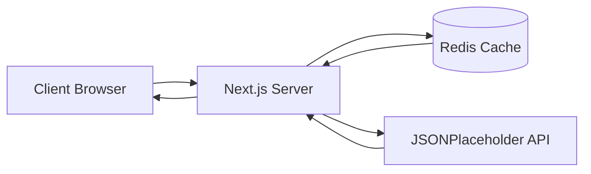

# Next.js Redis Benchmark App

A modern full-stack web application showcasing Redis caching strategies with Next.js. This project demonstrates the performance benefits of Redis caching in a real-world application, featuring client-side and server-side rendering approaches.


## Features

- 🚀 **Redis Caching Integration** - Implement and visualize Redis caching strategies
- 🎨 **Modern UI/UX** - Beautiful, responsive design with dark mode support
- ⚡ **Performance Benchmarking** - Compare cached vs. uncached API response times
- 📱 **Responsive Design** - Optimized for all device sizes
- 🌙 **Dark Mode** - Elegant light/dark theme switching with system preference support
- 🔄 **Real-time Cache Management** - Monitor and control Redis cache through the web interface
- 🎯 **Client & Server Components** - Showcase Next.js 13+ features
- 🔍 **API Response Caching** - Efficient caching of JSONPlaceholder API responses
- 📊 **Cache Analytics** - Real-time monitoring of cache performance metrics

## Tech Stack

- **Frontend:**
  - Next.js 13+ (App Router)
  - React 18
  - Tailwind CSS
  - Lucide Icons
  - shadcn/ui Components

- **Backend:**
  - Next.js API Routes
  - Redis
  - JSONPlaceholder API Integration

- **Performance & Utilities:**
  - Redis for Caching
  - SWR for Data Fetching
  - next-themes for Dark Mode

## Architecture Summary

### Application Flow


### Rendering Strategies
- **Server-Side Rendering (SSR)**
  - Users page demonstrates SSR with Redis caching
  - Initial request populates Redis cache
  - Subsequent requests serve from cache
  - Automatic cache invalidation after TTL

- **Client-Side Rendering (CSR)**
  - Posts page showcases CSR with SWR
  - API routes handle Redis caching logic
  - Real-time cache status updates
  - Optimistic UI updates

## Caching Strategy

### Key Design
- **Format**: `{prefix}:{entity}:{id}`
- **Examples**: 
  - `api:posts:1`
  - `api:users:list`
  - `benchmark:results`

### TTL (Time To Live)
- Posts: 5 minutes
- Users: 10 minutes
- Benchmark results: 1 hour
- Cache invalidation: Automatic via TTL

### Cache Patterns
1. **Read-Through Caching**
   - Check cache first
   - If miss, fetch from API
   - Store in cache for future

2. **Cache Aside**
   - Parallel cache/API requests
   - Update cache asynchronously
   - Prevent thundering herd

3. **Cache Warming**
   - Pre-populate common requests
   - Scheduled cache updates
   - Maintain fresh data

## Component Structure and Responsibilities

### Page Components
- **`app/page.tsx`**
  - Main server component entry point
  - Wraps the HomePage component with MainLayout
  - Handles the root route ("/")

- **`components/pages/home-page.tsx`**
  - Client component for the landing page
  - Features interactive UI elements and animations
  - Contains the hero section, feature cards, and information cards
  - Demonstrates Redis caching workflow and benefits

### Layout Components
- **`components/layouts/main-layout.tsx`**
  - Provides consistent layout structure across pages
  - Handles navigation and theme switching
  - Manages responsive design adjustments

### Feature Components
- **`components/benchmark/performance-chart.tsx`**
  - Handles performance benchmarking visualization
  - Displays real-time cache vs. non-cache comparisons
  - Manages benchmark data fetching and state

### UI Components
- **`components/ui/card`**
  - Reusable card components for consistent styling
  - Used across feature cards and information sections
  - Supports hover effects and animations

- **`components/ui/button`**
  - Styled button components with variants
  - Handles interactive states and animations
  - Used for navigation and actions

- **`components/ui/section-header`**
  - Consistent heading styles across sections
  - Manages responsive typography

### Data Fetching and Caching
- **`app/api/`**
  - API route handlers for data fetching
  - Implements Redis caching logic
  - Manages cache invalidation and TTL

### State Management
- Uses React hooks for local state
- SWR for remote data fetching and caching
- Redis for server-side caching
- Theme context for dark/light mode

### Utility Functions
- Redis connection management
- Cache key generation and management
- Performance metric calculations
- API response formatting

This structure ensures:
- Clear separation of concerns
- Reusable component architecture
- Efficient state management
- Consistent styling and theming
- Optimized performance through caching

## Getting Started

### Prerequisites

- Node.js 18+ 
- Redis Server
- npm or yarn

### Installation

1. Clone the repository:
   ```bash
   git clone https://github.com/Vansh0204/NextJs-and-Radis-Project.git
   cd NextJs-and-Radis-Project
   ```

2. Install dependencies:
   ```bash
   npm install
   # or
   yarn install
   ```

3. Set up environment variables:
   ```bash
   cp .env.example .env.local
   ```

### Running with Docker

1. Build and run with Docker Compose:
   ```bash
   docker-compose up -d
   ```

2. Access the application at http://localhost:3000

### Running Locally

1. Start Redis server:
   ```bash
   redis-server
   ```

2. Run the development server:
   ```bash
   npm run dev
   # or
   yarn dev
   ```

3. Open [http://localhost:3000](http://localhost:3000) in your browser.

## Environment Variables

Create a `.env.local` file with the following variables:

```env
# Redis Configuration
REDIS_URL=redis://localhost:6379
REDIS_PASSWORD=your_redis_password # Optional if no password set

# API Configuration
NEXT_PUBLIC_API_URL=https://jsonplaceholder.typicode.com

# Cache Configuration
CACHE_TTL_POSTS=300 # 5 minutes
CACHE_TTL_USERS=600 # 10 minutes
CACHE_TTL_BENCHMARK=3600 # 1 hour
```

## API Routes

### Posts API

- `GET /api/posts` - Fetch all posts (cached)
- `GET /api/posts/[id]` - Fetch single post by ID (cached)

### Users API

- `GET /api/users` - Fetch all users (cached)
- `GET /api/users/[id]` - Fetch single user by ID (cached)

### Cache Management

- `POST /api/cache/clear` - Clear Redis cache
- `GET /api/cache/status` - Get cache status and statistics

## UI Features

### Dark Mode
- System preference detection
- Smooth theme transitions
- Persistent theme selection
- Custom UI elements for both themes

### Responsive Design
- Mobile-first approach
- Adaptive navigation
- Flexible layouts
- Touch-friendly interactions

### Redis Management Interface
- Real-time cache monitoring
- Cache hit/miss statistics
- Cache clearing functionality
- Response time comparisons

## Performance Benchmarking

The application includes a built-in benchmark tool that compares:
- Direct API calls vs. Redis cached responses
- Response time improvements
- Cache hit/miss ratios
- Real-time performance metrics

## Screenshots

### Light Mode


### Dark Mode


### Mobile View


### Benchmark Results


As usage scales to thousands or even millions of users, our architecture is designed to remain fast, resilient, and cost-efficient through smart caching and cloud-native infrastructure practices.

### ⚡ Intelligent Caching with Redis

#### Multi-Level Caching
- **Redis Cluster Setup**
  - Horizontal scaling across multiple nodes
  - Master-replica configuration for high availability
  - Data partitioning for improved performance
  - Automatic failover with Redis Sentinel

#### Cache Optimization
- **Smart TTL Strategy**
  - Dynamic TTL based on data type and access patterns
  - Automated cache warming for high-traffic routes
  - Intelligent cache invalidation using key patterns
  - Memory usage optimization with eviction policies

#### Key Design Patterns
```
# Entity-based keys with TTL
user:{id} -> 1 hour TTL
post:{id} -> 30 min TTL
posts:list -> 5 min TTL

# Benchmark results with longer retention
benchmark:results:{date} -> 24 hour TTL
```

### 🏗 Infrastructure Adaptability

#### Cloud-Native Deployment
- **Serverless Options**
  - Vercel for Next.js frontend
  - AWS Lambda for API functions
  - Edge functions for global performance

- **Container-Based**
  - Docker containers for consistent environments
  - Kubernetes for orchestration
  - Automated scaling based on load

#### Global Distribution
- **Multi-Region Deployment**
  ```mermaid
  graph TD
    LB[Load Balancer] --> R1[Region 1]
    LB --> R2[Region 2]
    LB --> R3[Region 3]
    R1 --> RC1[(Redis Cluster 1)]
    R2 --> RC2[(Redis Cluster 2)]
    R3 --> RC3[(Redis Cluster 3)]
  ```

- **CDN Integration**
  - Static asset caching
  - Edge caching for API responses
  - Global content delivery
  - Automatic SSL/TLS

### 📊 Scalable by Design

#### Performance Monitoring
- **Real-Time Metrics**
  - Response time tracking
  - Cache hit/miss ratios
  - Error rates and status codes
  - Resource utilization

- **Automated Responses**
  - Auto-scaling triggers
  - Alert thresholds
  - Performance anomaly detection
  - Self-healing mechanisms

#### Data Management
- **Read Optimization**
  - Connection pooling
  - Query caching
  - Read replicas
  - Data partitioning

- **Write Optimization**
  - Write-behind caching
  - Batch processing
  - Event-driven updates
  - Eventual consistency

### 🛡 High Availability

#### Redundancy
- Multiple application instances
- Redis cluster with replicas
- Cross-region backups
- Automated failover

#### Disaster Recovery
- Regular Redis snapshots
- Point-in-time recovery
- Automated backup testing
- Recovery time objectives (RTO)

### 📈 Cost Optimization

#### Resource Management
- Auto-scaling based on demand
- Cache size optimization
- Efficient data storage
- Resource cleanup automation

#### Performance vs. Cost
- Balanced caching strategies
- Optimal instance sizing
- Traffic-based scaling
- Cost monitoring and alerts

This scalability approach ensures the application remains:
- 🚀 Fast and responsive under load
- 💪 Resilient to failures
- 📊 Easy to monitor and maintain
- 💰 Cost-efficient at scale
- 🌍 Globally accessible

## Project Structure and File Documentation

### Root Directory
- **`package.json`**
  - Project dependencies and scripts
  - NPM configuration
  - Project metadata and version info

- **`next.config.js`**
  - Next.js configuration
  - Environment variables setup
  - Build and runtime settings

- **`tsconfig.json`**
  - TypeScript configuration
  - Path aliases
  - Compiler options

- **`tailwind.config.ts`**
  - Tailwind CSS configuration
  - Theme customization
  - Plugin setup

- **`docker-compose.yml`**
  - Docker container configuration
  - Redis service setup
  - Network configuration

- **`.env.local` & `.env.production`**
  - Environment variables
  - API keys and secrets
  - Configuration values

### App Directory (`/app`)
- **`layout.tsx`**
  - Root layout component
  - Global providers setup
  - Meta tags and SEO

- **`page.tsx`**
  - Home page server component
  - Main layout integration
  - Root route handler

- **`globals.css`**
  - Global styles
  - Tailwind directives
  - CSS variables

- **`api/`**
  - **`posts/route.ts`** - Posts API endpoints
  - **`users/route.ts`** - Users API endpoints
  - **`cache/route.ts`** - Cache management endpoints
  - **`benchmark/route.ts`** - Benchmark API endpoints

### Components Directory (`/components`)
- **`layouts/`**
  - **`main-layout.tsx`** - Main application layout
  - **`nav-bar.tsx`** - Navigation component
  - **`footer.tsx`** - Footer component

- **`pages/`**
  - **`home-page.tsx`** - Home page client component
  - **`benchmark-page.tsx`** - Benchmark page component
  - **`users-page.tsx`** - Users list page component

- **`benchmark/`**
  - **`performance-chart.tsx`** - Performance visualization
  - **`benchmark-controls.tsx`** - Benchmark control panel
  - **`results-display.tsx`** - Results display component

- **`ui/`**
  - **`button.tsx`** - Reusable button component
  - **`card.tsx`** - Card component
  - **`section-header.tsx`** - Section header component
  - **`loading-spinner.tsx`** - Loading indicator
  - **`theme-switch.tsx`** - Theme toggle component

- **`theme-provider.tsx`**
  - Theme context provider
  - Dark/light mode management

### Lib Directory (`/lib`)
- **`redis.ts`**
  - Redis client configuration
  - Connection management
  - Cache utility functions

- **`api-client.ts`**
  - API client setup
  - Request handlers
  - Response formatting

- **`utils/`**
  - **`cache.ts`** - Cache utility functions
  - **`benchmark.ts`** - Benchmark utilities
  - **`formatting.ts`** - Data formatting helpers

### Hooks Directory (`/hooks`)
- **`use-cache.ts`**
  - Cache management hooks
  - Cache state handling
  - Cache operations

- **`use-benchmark.ts`**
  - Benchmark hooks
  - Performance measurement
  - Results management

- **`use-theme.ts`**
  - Theme management hook
  - System preference detection
  - Theme persistence

### Configuration Files
- **`components.json`**
  - shadcn/ui components config
  - Component theming
  - Style preferences

- **`postcss.config.js`**
  - PostCSS configuration
  - CSS processing setup
  - Plugin configuration

### Type Definitions
- **`next-env.d.ts`**
  - Next.js type definitions
  - Environment variables types
  - Global type augmentation

This structure follows these organizational principles:
1. **Separation of Concerns**
   - Clear distinction between server and client components
   - Modular component architecture
   - Isolated utility functions

2. **Feature-based Organization**
   - Related components grouped together
   - Feature-specific hooks and utilities
   - Logical file hierarchy

3. **Configuration Management**
   - Environment-specific settings
   - Build and development tools
   - Type system setup

4. **Performance Optimization**
   - Strategic code splitting
   - Efficient caching setup
   - Optimized build configuration

## Contributing

Contributions are welcome! Please feel free to submit a Pull Request.

## License

This project is licensed under the MIT License - see the [LICENSE](LICENSE) file for details.

## Contact

Vansh Agarwal
- GitHub: [@Vansh0204](https://github.com/Vansh0204)
- LinkedIn: [vansh-agarwal-0413j](https://www.linkedin.com/in/vansh-agarwal-0413j)
- Instagram: [@all.about.vansh](https://www.instagram.com/all.about.vansh/)

## Acknowledgments

- [Next.js Documentation](https://nextjs.org/docs)
- [Redis Documentation](https://redis.io/docs)
- [JSONPlaceholder](https://jsonplaceholder.typicode.com) for the API
- [Tailwind CSS](https://tailwindcss.com) for styling
- [shadcn/ui](https://ui.shadcn.com) for UI components
